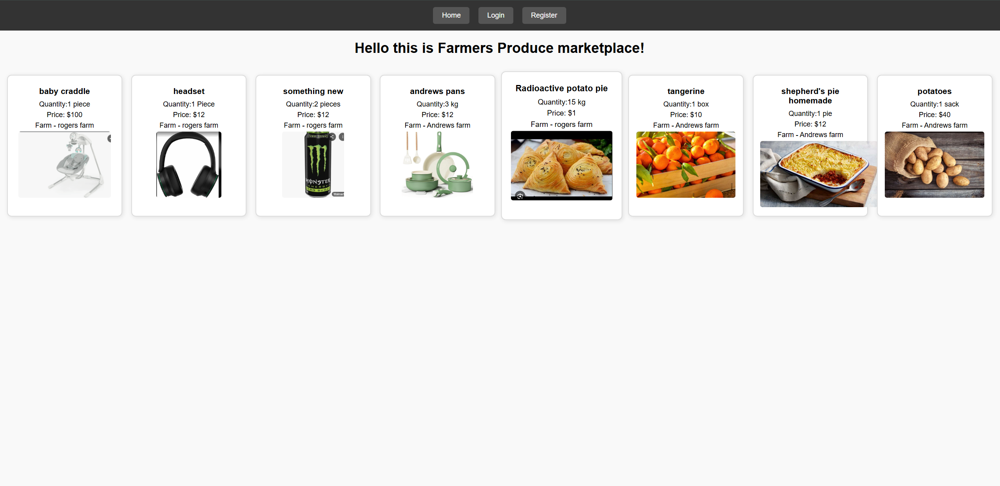

# Farmers Produce marketplace

#### it is a marketplace for local small farm owners to post what they have and let their neighbors know what they can buy.

login page

Registration page

home logged out page

This is the home page while logged in, it is the same even when you are not logged in as this one shows all the produce posted by everyone.

you have access to my produce page it gives you access to see only the listings posted by you and you can delete them here 

my produce page For Rogers farm as an example

example of uploading a pic and creating new product

## Description
It is a marketplace for local farmers, to post what they have and sell it to each other. This app is designed for small rural comunities where they don't have access to amazon or other big stores like walmart 
## Table of Contents
* [Technologies Used](#technologiesused)
* [Features](#features)
* [Design](#design)
* [Project Next Steps](#nextsteps)
* [Deployed App](#deployment)
* [About the Author](#author)

## Technologies Used
* Node.js
* Express
* JavaScript
* React
* Vite
* CSS
* Nodemon
* Bcrypt
* JWT
* Cloudinary
* MONGODB
* Multer

## Features
Post your own produce you have grown or post whatever you have to sell.

## Wireframe Images
* Description of image location, or 

## Microsoft whiteboard Planning
* Link to Microsoft whiteboard - https://wbd.ms/share/v2/aHR0cHM6Ly93aGl0ZWJvYXJkLm1pY3Jvc29mdC5jb20vYXBpL3YxLjAvd2hpdGVib2FyZHMvcmVkZWVtLzFlMDE5NDI5ZTZiZTRjMDI4NzVlYjFiNDU1NWU1YzJlX0JCQTcxNzYyLTEyRTAtNDJFMS1CMzI0LTVCMTMxRjQyNEUzRF8xZDQ0ODZmOS1hNjM4LTQyNGEtODI5Yy1lN2RjNGRlNmIyMjA=
## Design
Regular CSS

## DB Structure

this is the structure of my db

## Project Next Steps
#### List of Future Features
* deploy it on render.com
* implement the ability to purchase and the cart function
* integrate a payment system like stripe or square
* implement the ability for regular buyer's to create an account and have their addresses and review system for each buyer and seller 
* maybe implement the location of the farmer to be shown on the local map

## Deployed Link
not deployed yet

* You can view the repository:
[Github.com](https://github.com/jacobworkdev/FarmersProduce/tree/main)
* If unable to view please go live locally through VS Code

## About The Author
I am interested in web development and Internet of things.
[Developer LinkedIn](https://www.linkedin.com/in/jakhongirm/)

